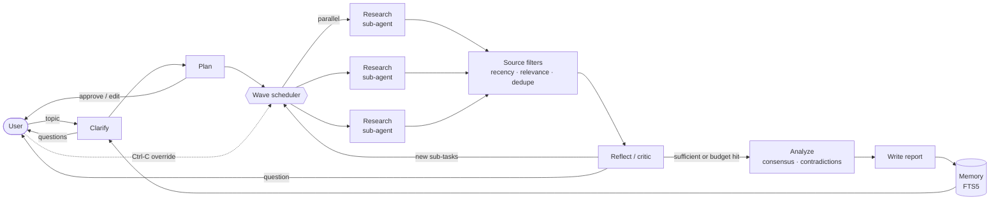

# rootlogic

An agentic **personal research assistant** for journalists, analysts and students.
Give it a topic; it asks clarifying questions if needed, drafts a research plan you can
edit, dispatches parallel research sub-agents that search the web, filters outdated or
irrelevant sources, reflects on gaps (researching more or asking you), cross-checks
sources for contradictions, and writes a cited report. Every step is logged and you
can pause and override it at any time.

Illustrative session (numbers are examples, not a benchmark):

```
$ rootlogic research "impact of generative AI on local newsrooms"
04:32:53 session.started    Session c3b11a10: “impact of generative AI on local newsrooms”
04:32:53 memory.recalled    Found 1 related past session(s): generative AI newsroom ethics
04:32:54 clarify.skipped    Topic is clear enough
04:32:58 plan.created       Plan: 5 sub-tasks, sources ≤ 365 days old
  ┌ plan table — [a]pprove / [e]dit / [q]uit ┐
04:33:01 task.started       [t1] Researching: How are local newsrooms adopting generative AI?
   ...                      (Ctrl-C → pause → skip t3 / add "Who funds this?" / note "focus on EU" / stop)
04:34:40 source.dropped     [t2] Dropped https://… — outdated (2019-01-01 < 2025-09-22)
04:35:12 reflect.done       Gaps found. No data on job losses → added [t6]
04:36:30 analyze.done       4 consensus point(s), 2 contradiction(s)
04:36:58 session.done       Report saved to .rootlogic/reports/c3b11a10-….md · 14 LLM calls · 212,480 tokens · $1.84
```

## Quick start

```bash
python3 -m venv .venv && source .venv/bin/activate
pip install -e '.[dev]'

rootlogic research --offline -y "any topic"      # no API key needed: deterministic fake LLM
export ANTHROPIC_API_KEY=sk-ant-...              # or `ant auth login`
rootlogic research "your topic"                  # live: Claude + web search

rootlogic research --engine graph "topic"       # LangGraph engine (resumable)
rootlogic resume <session>   # continue a graph session after a crash / quit
rootlogic graph              # print the LangGraph engine as a Mermaid diagram
rootlogic history            # past sessions + suggested next topics (long-term memory)
rootlogic log <session>      # full action log + conversation
rootlogic usage <session>    # tokens, web searches and cost per step
rootlogic show <session>     # re-print the report
rootlogic forget <session>   # delete a session and its memory
pytest                       # 37 tests, no network
```

Useful flags: `-y` auto-approve plan · `-v` show dropped sources · `--rounds N` reflection
rounds · `--max-tasks N` · `--parallel N` sub-agents · `--searches N` per sub-agent.
Data lives in `./.rootlogic/` (override with `ROOTLOGIC_HOME`).

## How it maps to the assignment

| Requirement | Where |
|---|---|
| Autonomous planning: break topic into sub-tasks, sequence without prompting | `Orchestrator._plan`, `Plan.ready()` (dependency-aware waves), `_research_loop` |
| Sub-tasks incl. finding articles, summarizing, identifying contradictions | research sub-agents (`llm.research`) → per-source summaries; `_analyze` → contradictions |
| Proactive search for recent info, filter outdated/irrelevant | `web_search`/`web_fetch` server tools; `filters.filter_sources` (recency, relevance, dedupe, blocklist) with logged reasons |
| Ask clarifying questions, adapt strategy in real time | `_clarify` (before planning) and `_reflect` (mid-run: new sub-tasks or questions to user) |
| Summaries + key takeaways per source (bonus) | `SourceDraft.summary/key_takeaways`, report source list |
| Long-term memory + related topic suggestions (bonus) | `Store.remember/recall` (SQLite FTS5), `Store.suggestions`, prior sessions fed to planner |
| Transparent action log, monitor/override (bonus) | `events` table + live stream; plan approve/edit; Ctrl-C override (skip/add/note/stop/abort) |
| Clear, testable orchestration | plain-Python state machine behind an `LLM` protocol; `FakeLLM` + `ScriptedUI` tests |

## Architecture



**Pattern: orchestrator–workers + evaluator loop.** The LLM decides *what* to research
(plan, follow-ups, questions, summaries, contradictions). Plain Python decides *how* the run
proceeds (ordering, parallelism, budgets, filtering, human checkpoints). That split is what
makes the agent both autonomous and testable, and keeps cost bounded.

| Module | Responsibility |
|---|---|
| `orchestrator.py` | Stage machine: clarify → plan → waves ⇄ reflect → analyze → write. Budgets, checkpoints, overrides. |
| `llm.py` | `LLM` protocol + `AnthropicLLM`: structured outputs (JSON schema) and the research tool loop (`web_search`, `web_fetch`, strict `submit_findings`). Usage → cost. |
| `models.py` | Pydantic schemas. LLM-facing ones are strict (all required, no extras). |
| `filters.py` | Deterministic source rules; every drop gets a reason in the log. |
| `store.py` | SQLite: sessions, conversation, action log, tasks, sources, per-call token usage, FTS5 memory. |
| `control.py` | `Event`, `Command`, `Interaction` protocol, thread-safe pause flag. |
| `prompts.py` | Static role prompts (clarifier, planner, researcher, critic, analyst, writer). |
| `cli.py` | Rich terminal UI implementing `Interaction`. |
| `fake_llm.py` | Deterministic LLM for tests and `--offline` demos. |

### Key design decisions

- **Raw Claude Messages API, no agent framework.** The orchestration is the thing being graded,
  so it's explicit code rather than framework configuration. `LLM` is a 2-method protocol, so
  swapping providers or adding LangGraph later touches one file.
- **Structured outputs everywhere the orchestrator branches** (clarify/plan/reflect/analyze/report),
  so control flow never parses free text.
- **Sub-agents get isolated context**: each research worker sees only its question, the
  objective, user guidance and dependency results — not the whole run. Results come back as
  a compact `FindingDraft`, keeping the orchestrator's context small.
- **Model proposes, code disposes** for sources: the worker rates credibility/relevance and
  dates; `filters.py` applies explicit rules. Low-credibility sources are kept but flagged,
  so dissent isn't silently hidden.
- **Bounded autonomy**: `Budget` caps reflection rounds, total sub-tasks, parallelism and
  searches per worker. Budget hits are logged, not silent.
- **Human checkpoints at the cheap moments**: before planning (clarify), before spending
  (plan approval), between waves (override). Workers never block on the user.
- **Web content is untrusted**: researcher prompt forbids following instructions found in pages.
- **Refusals**: server-side `fallbacks: "default"` retries safety-declined requests on a fallback
  model; a remaining refusal fails only that sub-task.
- **Model**: `claude-opus-5` for all roles; effort `low` for clarify, `medium` for research
  workers, `high` for plan/reflect/analyze/report.

### Storage

SQLite single file (`.rootlogic/rootlogic.db`), all rows keyed by `session_id`:

| Table | Purpose |
|---|---|
| `sessions` | topic, status, plan JSON, summary, related topics, report path |
| `messages` | human ↔ agent conversation (topic, clarifying Q&A, notes, report summary) |
| `events` | append-only action log (every decision, drop, override) |
| `tasks` | sub-task status + finding JSON |
| `sources` | every source seen, kept or dropped with reason |
| `llm_calls` | per-request tokens (input/output/cache read/cache write), web searches, cost, request id |
| `memory_fts` | FTS5 index of past session topics/summaries/takeaways for recall |

New to agents? Start with [docs/walkthrough.md](docs/walkthrough.md), a step-by-step account
of how this project was built. See [docs/research/agentic-research-assistant.md](docs/research/agentic-research-assistant.md)
for the research behind these choices (frameworks, storage options, protocols, UX, tools) and an
alternative architecture (LangGraph + web UI).

## Two engines

The same agent is implemented twice: a hand-rolled orchestrator loop (default) and a
LangGraph state machine (`--engine graph`) with checkpointing, `interrupt()`-based human
approval and `rootlogic resume`. Both share prompts, schemas, filters, storage and UI.
See [docs/langgraph-vs-loop.md](docs/langgraph-vs-loop.md) for a side-by-side comparison.

## Roadmap

- Web UI (FastAPI + SSE) implementing the same `Interaction` protocol
- Resume interrupted sessions from `plan_json` + `tasks`
- MCP client so users can plug in extra sources (Semantic Scholar, internal docs)
- Embedding-based memory (sqlite-vec) alongside FTS5
- Prompt caching for shared worker prefix; eval set of topics with graded reports
