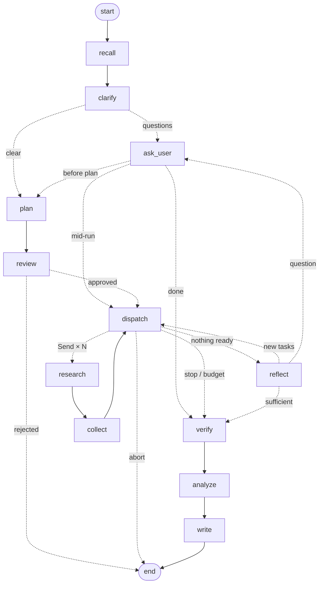

# Two engines, one agent: hand-rolled loop vs LangGraph

rootlogic ships the same research agent twice so the trade-off can be seen in code:

| | `--engine loop` (default) | `--engine graph` |
|---|---|---|
| File | [`rootlogic/orchestrator.py`](../rootlogic/orchestrator.py) (~680 lines) | [`rootlogic/graph.py`](../rootlogic/graph.py) (~780 lines) |
| Control flow | A Python `while` loop calling stage methods | A `StateGraph`: 12 nodes plus conditional edges |
| Parallel sub-agents | `ThreadPoolExecutor` | `Send("research", …)` fan-out, merged by a state reducer |
| Human decisions | `ui.ask()` / `ui.review_plan()` block the loop | `interrupt()`: a persisted pause that the runner answers with `Command(resume=…)` |
| Mid-run override (Ctrl-C) | Pause flag checked between waves | Same flag, which triggers an `interrupt()` inside `dispatch` |
| Crash / quit / network error | Session is marked failed and must start over | `rootlogic resume <id>` continues from the last completed step |
| State | Python attributes on the orchestrator | A `TypedDict` of plain dicts, checkpointed to `.rootlogic/checkpoints.db` |
| Dependencies | `anthropic`, `pydantic`, `rich` | plus `langgraph` and `langgraph-checkpoint-sqlite` |
| Tests | [`tests/test_orchestrator.py`](../tests/test_orchestrator.py) | [`tests/test_graph.py`](../tests/test_graph.py): the same scenarios plus two resume tests |

Everything else is shared by both engines: prompts, schemas, the LLM client, source filters,
the SQLite store, the terminal UI, and the prompt builders in
[`rootlogic/context.py`](../rootlogic/context.py).

## The graph

Regenerate it from the code with `rootlogic graph`. The `verify` node (claim verification and
corroboration) was added with the guardrails; both engines run it.

## What LangGraph gave us for free

1. **Resume.** Every step is checkpointed. In `test_resume_after_crash_skips_completed_work`
   the run dies at `analyze`. A brand-new engine instance resumes and makes exactly two LLM
   calls (`analyze`, `report`), with no re-planning and no re-research. That saves money on real runs.
2. **Durable human-in-the-loop.** A session can sit at "approve plan?" indefinitely. Closing
   the terminal loses nothing (`test_resume_while_waiting_for_plan_approval`). The same
   mechanism would let a web UI or a Slack message answer instead of a terminal prompt.
3. **An inspectable graph.** `rootlogic graph` prints the real control flow as a diagram, generated from the code.

## What it cost

1. **Re-execution on resume.** An interrupted node restarts from its first line. Anything
   before `interrupt()` runs twice: LLM calls, DB writes, log lines. Hence:
   - `clarify` (LLM call) and `ask_user` (interrupt) are separate nodes.
   - `review`, `ask_user` and `dispatch` do all side effects *after* `interrupt()` returns.
   - The Ctrl-C flag is peeked at, and cleared only after the override is answered, so the
     re-run still reaches the `interrupt()` call.
2. **Serializable state.** Checkpoints need plain data, so the state holds dicts and every
   node rehydrates Pydantic models (`Plan.model_validate(s["plan"])`). It's more ceremony
   than attributes on `self`.
3. **Reducers.** Parallel `research` nodes write to the same key at the same time. It needs
   an accumulate-then-clear reducer (`_raw_reducer`) that `collect` resets by writing `None`.
4. **Library quirks.** `Command(resume=None)` crashes inside LangGraph 1.2.12, because it treats
   `None` as "no resume value". Plan rejection therefore resumes with `{"approved": False}`.
5. **More code.** About 580 lines vs 420 for the same behaviour. The graph wiring and state
   bookkeeping are the difference.

## Which to present

- **Default to `loop`** when the goal is to show you understand agent orchestration. Every
  decision is a readable line of Python, and nothing is hidden in a framework.
- **Show `graph`** when asked "how would this run in production?". Resumability and durable
  human approval are what a real long-running research job needs, and the resume
  demo (kill it, `rootlogic resume <id>`) is memorable.
- A good interview answer is: "I built the loop first to own the logic, then ported it to
  LangGraph to get checkpointing. Here's what that cost me."
